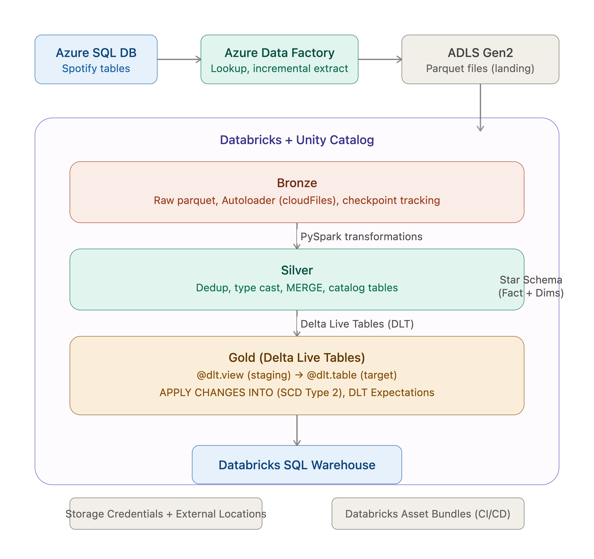

# Spotify-ELT-Pipeline-with-Delta-Live-Tables
**Overview**

End-to-end ELT pipeline built on Azure Databricks and Azure Data Factory, ingesting Spotify relational data through a Medallion Architecture (Bronze, Silver, Gold) with Delta Live Tables (DLT) for CDC and SCD Type 2 handling, Unity Catalog for governance, and Databricks Asset Bundles for deployment.

**Architecture**

**Data Source**

Spotify relational dataset with the following tables:
DimAlbum (album details)
DimArtist (artist details)
DimTrack (track details)
DimDate (date dimension)
FactStream (streaming events)

**Tech Stack**
Azure Data Factory (ADF)
Azure Data Lake Storage Gen2 (ADLS)
Azure Databricks
PySpark, Spark SQL
Delta Lake, Delta Live Tables (DLT)
Unity Catalog
Databricks Asset Bundles

**What I Built**
Source Layer (Azure SQL DB + ADF)
Stored the Spotify dataset in Azure SQL Database and used Azure Data Factory to orchestrate the extraction. Built ADF pipelines using Sub Activities, If-Else conditions, Lookup Activity, Date Lookup Activity, and Script Activity to handle conditional logic and incremental data extraction. Transferred the extracted data as files into Azure Blob Storage.

**Bronze Layer (Raw Ingestion)**

Landed the ADF output into ADLS in parquet format as the raw Bronze layer. Stored data as-is with no transformations, maintaining a full copy of every extraction run.

**Silver Layer (Databricks Transformations)**

Set up Azure Databricks workspace with External Locations using Storage Credentials, Unity Catalog with Catalog, Schema, and Tables. Used Autoloader (spark.readStream.format("cloudFiles")) for incremental data loading with checkpoint and schema location tracking. Applied transformations including drop duplicates, column renaming and casting with withColumn, filtering invalid records, and MERGE logic for Delta loads into Silver catalog tables.

**Gold Layer (Delta Live Tables + CDC)**

Built Delta Live Tables (DLT) pipelines for the Gold layer. Created staging tables using @dlt.view decorators and target streaming tables using @dlt.table. Applied APPLY CHANGES INTO (Auto CDC) flow for SCD Type 2 handling, which automatically tracks old and new records with updated_at timestamps. Added DLT Expectations for data quality validation before loading to target tables. Loaded final Gold tables into Unity Catalog.

**Challenges and Solutions**

Unity Metastore conflict with DLT: Initially used Unity Metastore for unified storage, but DLT pipeline creation failed due to metastore related issues. Resolved by creating separate storage paths for the Catalog and for DLT pipelines.

**Incremental load strategy**: Implemented incremental loading by capturing max(date) from each run and storing it in a file, which is used as the starting point for the next pipeline execution. This avoids full reloads and ensures only new data is processed from Source to Target via Azure Data Lake.

**Testing and Validation**
Loaded updated records at the Source SQL DB and ran the complete pipeline end to end through DLT. Verified that updated records were correctly identified at the DLT staging level, and 4 test records were updated at target tables, with old records marked as historical and new records flagged with the latest updated_at timestamp.

**Deployment**
Used Databricks Asset Bundles to package the pipeline for deployment across Prod and Dev environments.

**Key Learnings**
ADF orchestration with conditional activities for flexible pipeline logic
Autoloader for incremental ingestion with checkpoint based exactly-once processing
Delta Live Tables simplify CDC and SCD Type 2 compared to manual MERGE logic
DLT Expectations provide built-in data quality gates before loading to target
Unity Catalog and DLT have separate storage requirements that need careful configuration
Streaming reads with **ignoreChanges** option enable reading batch loaded tables as streams
Asset Bundles enable structured deployment across environments
